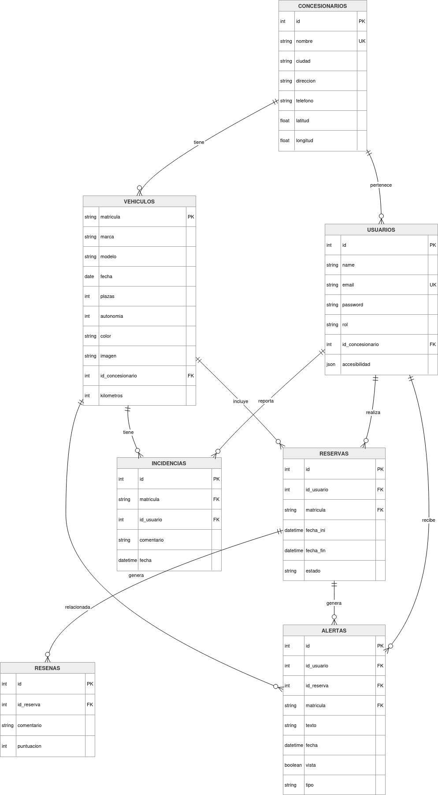

# EcoMóvil

Índice:

- [EcoMóvil](#ecomóvil)
  - [Descripción general](#descripción-general)
  - [Instalación y ejecución](#instalación-y-ejecución)
    - [Requisitos previos](#requisitos-previos)
    - [Pasos](#pasos)
  - [Tecnologías utilizadas](#tecnologías-utilizadas)
    - [Frontend](#frontend)
    - [Backend](#backend)
    - [Base de datos](#base-de-datos)
    - [Otras herramientas](#otras-herramientas)
  - [Arquitectura de la aplicación](#arquitectura-de-la-aplicación)
  - [Estructura del proyecto](#estructura-del-proyecto)
  - [Modelo de datos](#modelo-de-datos)
    - [Concesionarios](#concesionarios)
    - [Usuarios](#usuarios)
    - [Vehículos](#vehículos)
    - [Reservas](#reservas)
    - [Reseñas](#reseñas)
    - [Incidencias](#incidencias)
    - [Alertas](#alertas)
    - [Diagrama completo con relaciones](#diagrama-completo-con-relaciones)
  - [Casos de uso](#casos-de-uso)
    - [Usuario no autenticado](#usuario-no-autenticado)
    - [Encontrar un concesionario](#encontrar-un-concesionario)
    - [Encontrar un vehículo](#encontrar-un-vehículo)
    - [Reserva un vehículo](#reserva-un-vehículo)
    - [Manejo de mis reservas](#manejo-de-mis-reservas)
    - [Menú de alertas](#menú-de-alertas)
    - [Accesibilidad](#accesibilidad)
    - [Manejo del sistema](#manejo-del-sistema)
    - [Editar el perfil propio y cerrar sesión](#editar-el-perfil-propio-y-cerrar-sesión)
  - [Mejoras futuras](#mejoras-futuras)
  - [Autores](#autores)

## Descripción general

EcoMóvil es una aplicación web diseñada para la gestión de los concesionarios y vehículos de una compañía de alquiler de coches ficticia.

Permite a los usuarios buscar vehículos aplicando filtros, reservarlos cuando estén disponibles, y manejar sus reservas en curso, futuras o pasadas.

Existe además un panel de administración desde el que se pueden gestionar vehículos, usuarios y datos del sistema, como estadísticas o incidencias.

## Instalación y ejecución

### Requisitos previos

Debe tener instalado en su máquina:

- Node.js
- npm
- XAMPP o Docker con Docker Compose
- MySQL

### Pasos

1. Iniciar Apache y MySQL desde XAMPP, o usar el comando `docker compose up` en la raíz del proyecto.
2. En phpMyAdmin, crear una base de datos llamada `awdatabase` e importar el fichero `awdatabase.sql`.
3. Abrir la carpeta del proyecto en la terminal.
4. Instalar dependencias:

```bash
npm install
```

5. Ejecutar el proyecto:

```bash
npm start
```

6. Dirigirse a `localhost:3000`. Para comenzar a utilizar las funcionalidades de administrador, iniciar sesión con el siguiente usuario:

- Email: admin@ucm.es
- Contraseña: Admin123

7. Dirigirse al panel de administrador, y cargar el fichero JSON `datos.json` que se encuentra en la carpeta `utils` (u otro fichero JSON que cumpla las mismas restricciones de formato).

## Tecnologías utilizadas

### Frontend

- HTML5 / EJS
- CSS3
- JS
- Bootstrap
- Flatpickr: Librearía de JS para selector de fechas dinámico. Se utilizó sobre el date picker clásico de HTML debido a la incapacidad de éste para bloquear fechas específicas, lo cual es necesario para indicar al usuario en qué fechas ese vehículo ya tiene reservas y no puede ser reservado.
- Leaflet: Una librearía de JS para mostrar mapas gracias a la API de OpenStreetMap. Nos permite indicarle al usuario dónde están los concesionarios respecto de sí mismo.

### Backend

- Node.js
- Express

### Base de datos

- MySQL

### Otras herramientas

- XAMPP: Para la gestión de la BD.
- npm: Para la gestión de módulos de nodejs.
- Git: Para el desarrollo colaborativo de la aplicación.
- VSCode: IDE de elección para el desarrollo.

## Arquitectura de la aplicación

La aplicación sigue una arquitectura cliente-servidor:

- El frontend hace uso de la API del backend para poblar los datos de la página y realizar acciones sobre los datos (modificar, reservar, eliminar, crear...) de manera dinámica con uso de AJAX. El código del frontend se puede ver en las carpetas `views` (EJS) y `public` (CSS y JS).
- El backend dispone de dos tipos de "Routers", ambos desarrollados con Express:
  - Los de la "API": Hacen solicitudes de muestra o cambio de datos que responden con JSON para poder trabajar con AJAX.
  - Los normales: Redirigen y recargan la página, para poder acceder a las diferentes vistas de la aplicación o para ciertas acciones que lo requieren (como registrarse o subir datos con un JSON). Su código está disponible en el fichero `app.js` y la carpeta `routes`.
- El backend se comunica con la base de datos gracias a los DAOs (*Data Access Objects*) ubicados en la carpeta `db`.
- La base de datos MySQL almacena los elementos necesarios para la aplicación. La definición de la base se encuentra en el fichero `awdatabase.sql`.

## Estructura del proyecto

```text
/db

/public
  /css
    /styles.css -> Estilos y temas definidos para la aplicación
  /img
  /js
    /recursos
    accesibility.js -> Para las funcionalidades de accesibilidad.
    admin.js -> Para la población de datos y funcionalidades del panel de administrador
    ajax.js -> Definición de las funciones de fetch más ampliamente usadas (tenerlas definidas aquí permite exportarlas a los diferentes archivos JS donde se usan en lugar de re-definirlas en cada fichero)
    alertas.js -> Para la población de datos y funcionalidades de las alertas
    inicio.js -> Para la población de datos y funcionalidades del inicio
    misReservas.js -> Para la población de datos y funcionalidades de Mis Reservas
    ui.js -> Funciones útiles para la interfaz / UX.
    vehiculos.js -> Para la población de datos y funcionalidades de la pantalla de vehículos y reserva de vehículo

/routes
  /api
    admin.js
    alertas.js
    concesionarios.js
    misReservas.js
    reserva.js
    user.js
    vehiculos.js
  admin.js
  alertas.js
  misReservas.js
  reserva.js
  user.js
  vehiculos.js

/uploads

/utils

/views
  /partials
```

## Modelo de datos

### Concesionarios

- id (key)
- nombre (único)
- ciudad
- dirección
- telefono
- latitud
- longitud

### Usuarios

- id (key)
- name
- email (único)
- password
- rol
- id_concesionario (foreign key con tabla de concesionarios)
- accesibilidad: JSON con los valores elegidos por el usuario

### Vehículos

- matricula (key)
- marca
- modelo
- fecha
- plazas
- autonomía
- color
- imagen
- id_concesionario (foreign key con tabla de concesionarios)
- kilometros

### Reservas

- id (key)
- id_usuario (foreign key con tabla de usuarios)
- matricula (foreign key con tabla de vehículos)
- fecha_ini
- fecha_fin
- estado

### Reseñas

- id (key)
- id_reserva (foreign key con tabla de reservas)
- comentario
- puntuación (constraint: debe estar entre 1 y 5)

### Incidencias

- id (key)
- matricula (foreign key con tabla de vehículos)
- id_usuario (foreign key con tabla de usuarios)
- comentario
- fecha

### Alertas

- id (key)
- id_usuario (foreign key con tabla de usuarios)
- id_reserva (foreign key con tabla de reservas)
- matricula (foreign key con tabla de vehículos)
- texto
- fecha
- vista
- tipo

### Diagrama completo con relaciones



## Casos de uso

### Usuario no autenticado

El usuario puede elegir:

- Registrarse
  - Abre el modal de autenticación y hace click en 'Registrarse'
  - Completa el formulario con datos correctos (si no, recibirá error)
  - Hace click en el botón 'Registrarse' al final del formulario
  - Aparece un mensaje de éxito y la página se recarga
- Iniciar sesión
  - Abre el modal de autenticación
  - Ingresa datos correctos y existentes en la base de datos
  - Aparece un mensaje de éxito y la página se recarga
- Al terminar la recarga de la página el usuario contará con todas las funcionalidades de un usuario registrado
- Existen dos roles de usuario: Admin o User (normal). Cuando un usuario se registra es User por defecto. Solo un Admin puede convertir a otro usuario en Admin.

### Encontrar un concesionario

- Accede a la página de inicio
- Acepta el acceso a la ubicación (opcional)
- Se mueve por el mapa y da click a los diferentes "pins" que indican la ubicación de los concesionarios. En caso de haber aceptado el acceso a la ubicación observa también su distancia respecto a un concesionario al hacer click sobre él

### Encontrar un vehículo

Precondición: El usuario debe estar autenticado para ver y reservar los vehículos.

- En el menú, hace click sobre la pestaña de 'Vehículos'
- Espera a que se cargue la página de vehículos
- Scrollea por las opciones disponibles
- En el menú de la izquierda, selecciona las opciones de filtros que desea

### Reserva un vehículo

Precondición: El usuario debe estar autenticado para realizar reservas.
Hay dos caminos posibles para comenzar la reserva de un vehículo:

1. Tras acceder a la página de vehículos y filtrar entre las opciones para encontrar el vehículo que desea, hace click en el botón de 'Reservar' que se muestra al final de cada carta de vehículo. Se le redirige a la página de 'Reservar', con el vehículo en cuestión pre-seleccionado desde el seleccionador.
2. Desde cualquier página de la aplicación selecciona 'Reservar' en el menú de navegación. Se le mostrará el formulario de reserva y deberá seleccionar la matrícula del coche a reservar desde un seleccionador.

Una vez se encuentra en la página de reservas con un vehículo seleccionado:

- Selecciona una fecha de inicio del date picker (de flatpickr).
- Selecciona una fecha de fin del date picker (de flatpickr).
- Acepta las condiciones
- Si los datos introducidos son correctos, se mostrará un mensaje de éxito.
- Si los datos no son correctos, se mostrará un mensaje de error.

### Manejo de mis reservas

Precondición: El usuario debe estar autenticado para observar sus reservas.

- Desde cualquier página de la aplicación, hace click en el botón 'Mis Reservas' del menú de navegación. Se le redirige a la página correspondiente.
- Usando los tabs de Bootstrap, navega entre las reservas en curso, futuras o pasadas.
- Si tiene una reserva actual puede hacer click en el botón 'Reportar una incidencia' y rellenar el modal que se abre para reportar cualquier problema durante la reserva.
- Si tiene una reserva actual puede hacer click en el botón 'Devolver vehículo' y rellenar el modal correspondiente (no es necesario dejar una reseña, aunque sí es obligatorio dejar constancia de los kilómetros recorridos), para que la reserva pase a la pestaña de 'Pasadas'.
- Si tiene reservas pasadas puede ver sus fechas y la reseña correspondiente (si hizo).
- Si tiene reservas futuras puede hacer click en el botón 'Cancelar' para cancelar la reserva. Ya no aparecerá ni contará para las estadísticas del sistema. El vehículo volverá a aparecer como disponible en las fechas en las que lo ocupaba esa reserva.

### Menú de alertas

Precondición: El usuario debe estar autenticado para observar sus reservas.

- Desde cualquier página de la aplicación, hace click en el botón con forma de campana del menú de navegación. Se le redirige a la página correspondiente. El botón mostrará un punto rojo si hay alertas que no estén marcadas como leídas.
- Si el usuario cuenta con alguna alerta (por haber reservado un vehículo con baja autonomía, por estar cerca de la fecha de devolución en una reserva en curso, o por haber sobrepasado susodicha fecha de devolución), podrá marcarla como leída o eliminarla.
- Puede usar el botón 'Recargar alertas' para recargar automáticamente las alertas (por si hubiese nuevas a las que no quiere esperar).

### Accesibilidad

- Hace click en el botón de ajustes de la barra de navegación. Se abre el modal de ajustes de accesibilidad.
- Selecciona si quiere que la página esté en inglés o español.
- Selecciona el tema (colores del sistema) que desea usar.
- Selecciona el tamaño de la letra que desea usar.
- Edita (incluso elimina) los atajos del teclado como vea conveniente.
- Si el usuario tenía sesión iniciada, estos cambios se guardarán automáticamente en la base de datos del usuario. En cualquier caso, se guardarán también en `localStorage` para así persistir en el navegador.

### Manejo del sistema

Precondición: El usuario debe estar autenticado con una cuenta de administrador para acceder al panel de administración.

- Desde cualquier página de la aplicación, hace click en el botón 'Admin' del menú de navegación. Se le redirige a la página correspondiente.
- Usando los tabs de bootstrap para navegar entre la subida de datos, manejo de concesionarios, manejo de vehículos, manejo de usuarios, visualización de estadísticas y visualización de incidencias.
- Para subir un fichero JSON, basta con hacer click al botón correspondiente, elegir el fichero en el dispositivo, y pulsar el botón de envío. La página se recargará y se mostrará si los concesionarios y vehículos se han insertado, o en el caso de que ya existiesen, se han actualizado.
- Para realizar operaciones CRUD sobre concesionarios se puede ir a la pestaña correspondiente. El formulario de alta crea un concesionario si los datos son correctos. Por otro lado, la tabla que muestra los concesionarios existentes, permite también editarlos o eliminarlos gracias a los botones de la última columna.
- Ídem para vehículos.
- Para realizar operaciones CRUD sobre usuarios se puede ir a la pestaña correspondiente y hacer uso de la tabla que se muestra para editarlos o eliminarlos. Un administrados no puede crear a un usuario, deberá registrarse él mismo.
- Para visualizar las estadísticas del sistema basta con navegar a la pestaña correspondiente y observar los datos que se muestran.
- Para visualizar las incidencias de reservas, basta con navegar a la pestaña correspondiente y observar la lista de incidencias. En el selector de arriba se puede filtrar por el vehículo al que se refiere la incidencia.

### Editar el perfil propio y cerrar sesión

Precondición: El usuario debe estar autenticado.

- Desde cualquier página de la aplicación, hace click sobre la imagen de usuario en el menú de navegación. Se abre el modal correspondiente. Puede editar el formulario para cambiar su nombre, email o concesionario. Puede hacer click sobre el botón 'Cerrar sesión' para recargar la página y cerrar su sesión.

## Mejoras futuras

Las funcionalidades que consideramos más interesantes a introducir en el futuro son:

- La subida dinámica de imágenes por parte de los usuarios y administradores para tener fotos de perfil o añadir imágenes a la lista de posibles imágenes de vehículos sin necesitar acceso directo al servidor.
- Implementación de tests unitarios para validar que todas las funcionalidades funcionan de la manera esperada en casos límite.

## Autores

- Inés Triviño
- Néstor García